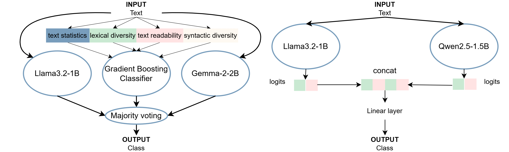

# Grape at GenAI Detection Task 1: Leveraging Compact Models and Linguistic Features for Robust Machine-Generated Text Detection

In this project, we aim to solve two Subtasks of Task 1: Binary Multilingual Machine-Generated Text(MGT) Detection (Human vs. Machine) as part of the COLING 2025 Workshop on MGT Detection by different approaches. The first method is separate fine-tuned small language models on the specific subtask. The second approach enhances this methodology by incorporating linguistic, syntactic, and semantic features, using ensemble learning to combine these features with model predictions for a more robust classification. By evaluating and comparing these approaches, we want to identify the most effective techniques for detecting machine-generated content across languages, offering insights into improving automated verification tools amid the rapid growth of LLM-generated text in digital spaces.

From left to right is our proposed approach for Subtask A English-only and Subtask B Multilingual track

